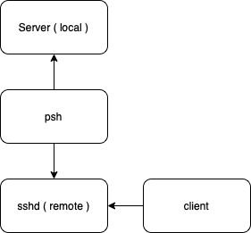

# psh

Proxy by SSH => psh

## develop guidance

- Docker
- Remote host compute
- Config file `psh.yaml`

## use guidance

  The project `psh` work like the picture, it will listen ports (define in `psh.yaml`) at `remote`
  machine and then forward traffic that comes from `client` to `local` by ssh protocol.

  

  You can use it by following ways:

- Define config file `psh.yaml` according to your own situation.
- You can also rename config file and by `psh -config <file_name>` to use it.
- Run binary file `psh` on macOS, Linux. (Windows is `psh.exe`)
- List more help messages by `psh -h`.

## psh.yaml template

```yaml
host: <remote_host>:22
user: root
# One of [password, identity_file] is required
password: password
#identity_file: ~/.ssh/id_rsa
# server_alive_interval default closed
server_alive_interval: 60s
# server_alive_count_max control read, write timeout with server_alive_interval
server_alive_count_max: 3
# log_level is optional
log_level: 2
## retry_min (default value = 1s)
#retry_min: 1s
## retry_max (default value = 60s)
#retry_max: 60s
rules:
  - remote: "<remote_ip>:27011"
    local: 127.0.0.1:3000
    reverse: true
  - remote: "<remote_ip>:28000"
    local: 127.0.0.1:3001
    reverse: true
```
